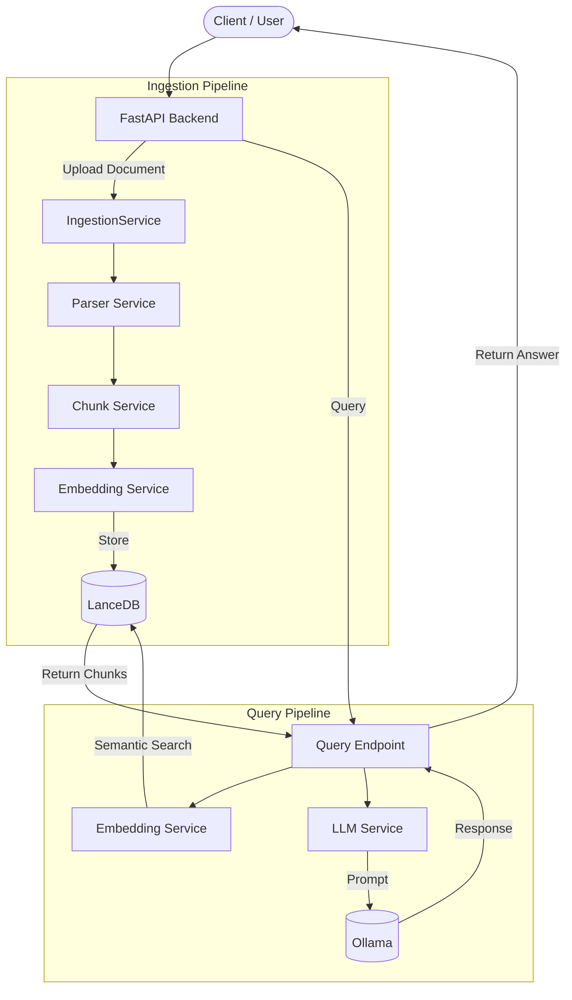

# System Architecture

This document describes the high-level architecture of the Local RAG Backend.

## Overview

The application is built completely offline, focusing on privacy and local deployment. It does not rely on any cloud LLMs or cloud Vector Databases.

## Components

### 1. API Layer (FastAPI)
- Handles HTTP routing and Pydantic validation.
- Endpoints:
  - `POST /api/v1/ingest`: Accepts document uploads.
  - `GET /api/v1/documents`: Lists ingested documents.
  - `DELETE /api/v1/documents/{id}`: Deletes a document.
  - `POST /api/v1/query`: Executes a RAG query.

### 2. Ingestion & Processing
- **Parser Service**: Extracts raw text from `.pdf`, `.html`, and `.md` using `PyMuPDF` and `BeautifulSoup4`.
- **Chunk Service**: Splits text into semantic blocks using a character-based overlap strategy (default 500 characters, 50 character overlap). Computes a SHA-256 hash of the content to generate a deterministic chunk ID.

### 3. Embedding & Vector Storage
- **Embedding Service**: Uses `sentence-transformers` running natively via PyTorch. It lazily loads the `BAAI/bge-small-en-v1.5` model into memory only when needed to save resources.
- **LanceDB**: A lightweight, embedded database powered by Apache Arrow. It persists the vectorized chunks directly to the filesystem at `data/lancedb/` enabling instantaneous top-k similarity searches without needing a standalone vector server like Milvus or Pinecone.

### 4. LLM Generation
- **LLM Service**: Uses `httpx.AsyncClient` to asynchronously ping a local Ollama daemon. The query is packaged with the context chunks extracted from LanceDB, strictly instructing the model to only answer based on the provided context to prevent hallucinations.
